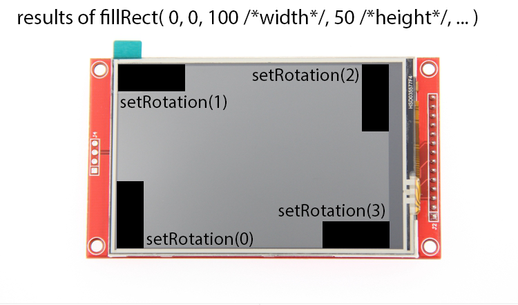
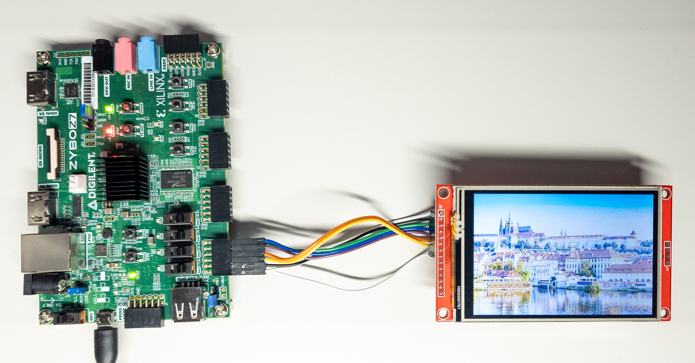
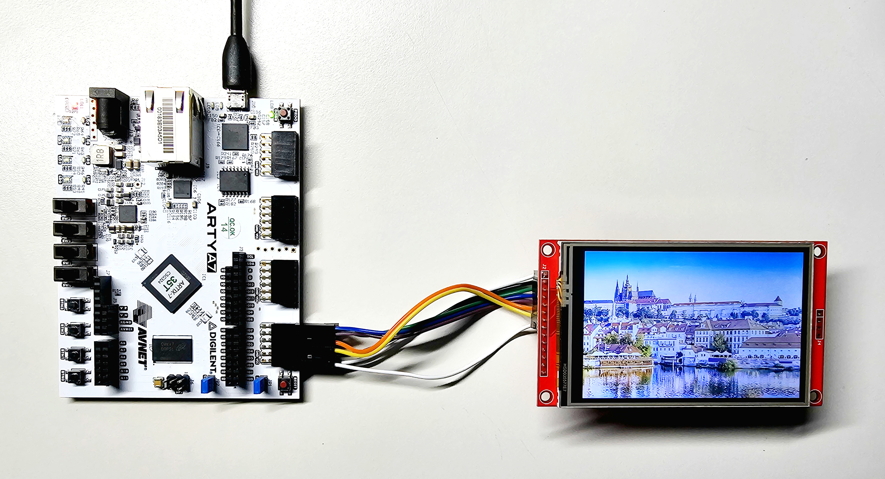

[](https://opensource.org/licenses/BSD-2-Clause)

# ILI9488 TFT display library for Xilinx FPGA and SoC

This is the port of Jaret Burkett's [ILI9488 Arduino library](https://github.com/jaretburkett/ILI9488) to AMD Xilinx SoC and FPGA.

I removed all Arduino-specific code, optimized SPI writes for the capabilities
of Xilinx SPI libraries, and made other modifications.  
The integral part was the porting of the [Adafruit_GFX library](https://github.com/adafruit/Adafruit-GFX-Library) because the ILI9488 library is based on it.

I tested the library on AMD Xilinx Zynq-7000 SoC and Artix-7 FPGA (running on [MicroBlaze](https://www.xilinx.com/products/design-tools/microblaze.html) soft CPU) with
the following display: [3.5&Prime; SPI Module ILI9488 SKU:MSP3520](http://www.lcdwiki.com/3.5inch_SPI_Module_ILI9488_SKU:MSP3520) (can be purchased on [Amazon](https://www.amazon.com/Hosyond-Display-Compatible-Mega2560-Development/dp/B0BWJHK4M6/ref=sr_1_1?crid=1JH7HIUGZU29J&keywords=3%2C5%22%2B480x320%2BSPI%2BTFT%2BILI9488&qid=1691653179&sprefix=3%2C5%2B480x320%2Bspi%2Btft%2Bili9488%2Caps%2C212&sr=8-1&th=1) or on [AliExpress](https://www.aliexpress.com/item/32995839609.html); I'm not affiliated in any way).

> [!NOTE]
> The ILI9488 3.5&Prime; TFT LCD module is a touch screen. However, the library presented here contains only graphics display capabilities. It does not read any user touch inputs from the display.

# How to use the library

## HW connection and setup

I'm describing here the connection of the [3.5″ TFT SPI Module ILI9488](http://www.lcdwiki.com/3.5inch_SPI_Module_ILI9488_SKU:MSP3520), which seems to be the most easily available display with the ILI9488 controller IC.

### Interfaces

ILI9488 display controller IC has several interfaces. The 3.5″ TFT SPI Module module in question uses "DBI Type C Option 3", which is, in fact, a 4-line SPI.  
The [ILI9488 datasheet](http://www.lcdwiki.com/res/MSP3520/ILI9488%20Data%20Sheet.pdf) specifies that the shortest possible SPI clock cycle for write operations is 50 ns, i.e., 20 MHz (see page 332 in the datasheet). Nevertheless, my specimen of the display was able to run with the SPI clock increased to 20.83 MHz.

In addition to the SPI, the display needs to be connected to two GPIO pins (reset and Data/Command selection signals).

The library supports both Zynq Processing System SPI and AXI Quad SPI IP (see [this short introduction](https://support.xilinx.com/s/article/796622) to the two types of SPI).  
The library also supports both Zynq Processing System [EMIO GPIO](https://support.xilinx.com/s/article/386661) and [AXI GPIO IP](https://www.xilinx.com/products/intellectual-property/axi_gpio.html).

Different kinds of SPI and GPIO can be combined (e.g., you can use AXI SPI with PS GPIO and vice versa). All four combinations are supported by the library.

### PS SPI setup

The [ILI9488 datasheet](http://www.lcdwiki.com/res/MSP3520/ILI9488%20Data%20Sheet.pdf) specifies that the minimum SPI clock cycle for write operations is 50 ns, i.e., 20 MHz (see page 332 in the datasheet).

The Zynq-7000 Processing System default SPI clock is 166.67 MHz. You can scale this frequency down by a power of two factors by calling [XSpiPs_SetClkPrescaler](https://xilinx.github.io/embeddedsw.github.io/spips/doc/html/api/group__spips.html#ga146ed84d7a6ab3b3f8961697bd78da60).

For getting a setting closest to the ILI9488 rated 20 MHz, we can call `XSpiPs_SetClkPrescaler(&SpiInstance,XSPIPS_CLK_PRESCALE_8)`, which gives us an SPI clock of 20.83 MHz (==&nbsp;166,67&nbsp;/&nbsp;8).  
20.83 MHz is higher than the 20 MHz from the datasheet. Nevertheless, my specimen of the display worked well at this frequency.

If you want to be on the safe side, you can set the SPI frequency to 150 MHz in the Zynq-7000 configuration in Vivado. Then, with the factor `XSPIPS_CLK_PRESCALE_8`, you get the SPI frequency of 18,75 MHz.

### AXI SPI setup

The library expects that the AXI Quad SPI is configured as a Master, in the standard mode and with a Transaction Width of 8 bits.

For best performance, I highly recommend configuring the AXI SPI IP with a FIFO of 256 bytes. (The library will work with a FIFO of 16 bytes and without a FIFO, but the performance will be reduced.)

To achieve the 20 MHz SPI clock for the ILI9488, I recommend to drive AXI SPI input signal ext_spi_clk with 40 MHz and set the Frequency Ratio in the IP configuration to 2.

I tested the library with AXI Quad SPI configured in this way:


### Physical connection

For using the [3.5&Prime; TFT SPI Module ILI9488](http://www.lcdwiki.com/3.5inch_SPI_Module_ILI9488_SKU:MSP3520) with the library, we need to connect the pins highlighted in the photo below.

- Please note that we do not need to connect the "SDO (MISO)" pin of the display to SPI because we are not reading any data from the display.

Logic IO pins accept a 3.3 V voltage level (TTL).


| Pin        | Meaning                                                                                             | Where to connect to                                                                                                     |
| ---------- | --------------------------------------------------------------------------------------------------- | ----------------------------------------------------------------------------------------------------------------------- |
| LED        | Display backlight control; level 3.3 V gives maximum brightness                                     | 3.3 V power source                                                                                                      |
| SCK        | SPI bus clock signal,<br/>rated at 20 MHz<br/>(my specimen of the display worked at 20.83&nbsp;MHz) | PS&nbsp;SPI:&nbsp;SPI*x*_SCLK_O&nbsp;signal&nbsp;(e.g.,&nbsp;SPI0_SCLK_O)<br/><br/>AXI SPI: sck_o signal                |
| SDI (MOSI) | SPI bus write data signal (input into the display)                                                  | PS&nbsp;SPI:&nbsp;SPI*x*_MOSI_O&nbsp;signal&nbsp;(e.g.,&nbsp;SPI0_MOSI_O)<br/><br/>AXI SPI: io*x*_o signal (e.g. io0_o) |
| DC/RS      | Data/Command selection signal<br/>high: command, low: data                                          | A GPIO signal                                                                                                           |
| RESET      | Display reset signal, low for reset                                                                 | A GPIO signal                                                                                                           |
| CS         | SPI chip select signal, low level for enable                                                        | PS SPI: SPI*x*_SS_O signal (e.g., SPI0_SS_O)<br/><br/>AXI SPI: ss_o[*x*:*x*] signal (e.g. ss_o[0:0])                    |
| GND        | Ground                                                                                              | Ground                                                                                                                  |
| VCC        | 5 V or 3.3V power input                                                                             | 5 V or 3.3V power source                                                                                                |

## SW configuration and usage

### Using the library in Vitis

To use the library, copy the whole content of the [ILI9488-Xilinx_library](ILI9488-Xilinx_library) folder to the src folder of your application project in Vitis.

The library is defined as the class ILI9488 in [ILI9488_Xil.h](ILI9488-Xilinx_library/ILI9488_Xil.h) and [ILI9488_Xil.cpp](ILI9488-Xilinx_library/ILI9488_Xil.cpp).

The class ILI9488 extends the class Adafruit_GFX, which is defined (together with other needed classes) in the source files in the [Adafruit_GFX](ILI9488-Xilinx_library/Adafruit_GFX) folder.

Folder [Adafruit_GFX/Fonts](ILI9488-Xilinx_library/Adafruit_GFX/Fonts) contains definitions of several fonts that came with the Adafruit_GFX library.  
(See function [testBigFont](ILI9488-Xilinx_library_demo_app/main.cpp#L358) in the library [demo app](ILI9488-Xilinx_library_demo_app/main.cpp) for an example of use.)

> [!IMPORTANT]
> The compiler optimization matters!  
> There is a code in the library (especially in ILI9488::fillRect) which is CPU intensive.
> 
> Do build the final application in the Release configuration.
> 
> I recommend changing the Properties|C/C++ Build|Setting|Optimization to "Optimize most (-O3)" (the default is -O2 optimization setting).  
> I measured that using -O3 increases the library's performance as compared to -O2.

### Configuring the library

As described in the chapter [Interfaces](#interfaces), the display can be connected to the system using PS SPI or AXI SPI and PS GPIO or AXI GPIO.  
We need to tell the library which connection we use.  
The library is configured by editing the header [ILI9488_Xil_setup.h](ILI9488-Xilinx_library/ILI9488_Xil_setup.h). (The ILI9488_Xil_setup.h is being included by the ILI9488_Xil.h.)

You must edit the following section of this header, uncommenting one of the macros for SPI and one of the macros for GPIO:

```c
/**** select one of the SPI types used by given application ****/
//#define ILI9488_SPI_PS  //SPI of Zynq Processing Systems is used.
//#define ILI9488_SPI_AXI //AXI Quad SPI IP is used.

/**** select one of the GPIO types used by given application ****/
//#define ILI9488_GPIO_PS  //EMIO GPIO of Zynq Processing Systems is used.
//#define ILI9488_GPIO_AXI //AXI GPIO IP is used.
```

### Initializing the library

The class ILI9488 has an empty constructor.  
The initialization of the class and configuration of the display is done by the method ILI9488::init. During the execution of ILI9488::init, configuration commands are sent to the display over SPI.

> [!WARNING]
> You must call ILI9488::init  before using any other method of the ILI9488 class.

The method will raise std::invalid_argument or std::logic_error exceptions if it detects an issue with the parameters passed into it.

Here is the declaration of ILI9488::init for the case that AXI SPI and AXI GPIO are used (there are another three versions of ILI9488::init covering other combinations of SPI and GPIO connection; see [ILI9488_Xil.h](ILI9488-Xilinx_library/ILI9488_Xil.h#L106)):

```c
void ILI9488::init( XSpi *spi, XGpio *gpio, u32 _RSTPin, u32 _DCPin, unsigned _GPIOChannel = 1 );
```

| Parameter    | Meaning                                                      |
| ------------ | ------------------------------------------------------------ |
| spi          | Address of an [XSpi](https://xilinx.github.io/embeddedsw.github.io/spi/doc/html/api/struct_x_spi.html) instance representing an initialized SPI driver <ins>ready for use</ins>. |
| gpio         | Address of an [XGpio](https://xilinx.github.io/embeddedsw.github.io/gpio/doc/html/api/struct_x_gpio.html) instance representing an initialized GPIO driver <ins>ready for use</ins>. |
| _RSTPin      | Mask of the GPIO pin to which the RESET signal of the display is connected to.<br/>This mask is a value the library will use when calling functions [XGpio_DiscreteSet](https://xilinx.github.io/embeddedsw.github.io/gpio/doc/html/api/group__gpio.html#ga8f2cea7ef78412c03c7ebdba87b7cdd4)/[XGpio_DiscreteClear](https://xilinx.github.io/embeddedsw.github.io/gpio/doc/html/api/group__gpio.html#gae430718af9f347c91be42aad580b216c). A GPIO pin represented by bit 0 has the mask 0x01. |
| _DCPin       | Mask of the GPIO pin to which the DC/RS signal of the display is connected to. |
| _GPIOChannel | AXI GPIO IP can be configured to have two channels (i.e., two banks of GPIO ports.). The default channel is identified by value 1.<br/>In case you connect RESET and DC/RS signals to channel 2 of an AXI GPIO IP, provide 2 as the value of the _GPIOChannel parameter. (Please note that RESET and DC/RS signals must be in the same channel.) |

You must pass initialized and ready to use instances of SPI and GPIO drivers to the ILI9488::init.

> [!TIP]
> Part of this repository is a [demo application](ILI9488-Xilinx_library_demo_app), which shows the usage of the library. The application is implemented to work with all combinations of PS/AXI SPI/GPIO connections.
> 
> I recommend that you use functions [initialize_PS_SPI()](ILI9488-Xilinx_library_demo_app/main.cpp#L101), [initialize_AXI_SPI()](ILI9488-Xilinx_library_demo_app/main.cpp#L164), [initialize_PS_GPIO()](ILI9488-Xilinx_library_demo_app/main.cpp#L232) and [initialize_AXI_GPIO()](ILI9488-Xilinx_library_demo_app/main.cpp#L260) from the demo application as templates for SPI/GPIO interfaces initialization.

### SPI Slave selection

The code using the library is responsible for selecting the correct SPI Slave before calling any of the library's methods. The library doesn't do Slave selection.

On PS SPI, you can select, for example, Slave 0 by the call `XSpiPs_SetSlaveSelect(&SpiInstance, 0);`.

On AXI SPI, I recommend selecting a Slave by following commands:

```C
XSpi SpiInstance;

...

/* Select Slave 0 in the SPI instance configuration.
 * Parameter value 1 means that bit 0 is set, and therefore, Slave 0 is active.
 * We call this in order to have the correct value in SpiInstance.SlaveSelectReg.
 */
XSpi_SetSlaveSelect(&SpiInstance, 1);

/* Set the slave select register to select the device on the SPI before starting the transfer
 * of data. This call actually drives the respective SS signal low to activate the SPI slave.
 */
XSpi_SetSlaveSelectReg(&SpiInstance, SpiInstance.SlaveSelectReg);
```

> [!WARNING]
> On AXI SPI, you must select the Slave by calling [XSpi_SetSlaveSelectReg](https://xilinx.github.io/embeddedsw.github.io/spi/doc/html/api/group__spi.html#gae93befb10305b5abccc5483b73e60060), which does the actual write to the AXI SPI IP register, thus driving the relevant ss_o[*x*:*x*] signal low.
> 
> This is because, on AXI SPI, the library uses low-level SPI function [XSpi_WriteReg](https://xilinx.github.io/embeddedsw.github.io/spi/doc/html/api/group__spi.html#ga32e741800118678aa060ef2a13661e31), which does not set the slave register automatically based on the setting in the [XSpi](https://xilinx.github.io/embeddedsw.github.io/spi/doc/html/api/struct_x_spi.html) instance.

### Setting display rotation

The method `void ILI9488::setRotation(uint8_t rotation)` sets the position of the pixel [0,0] and the rotation of the graphics on the display.

The following image shows the effect of calling ILI9488::setRotation on the 3.5&Prime; TFT SPI Module ILI9488.  
The default setting is setRotation(0).



### Drawing graphics elements

You can refer to the Adafruit GFX library's [reference](https://adafruit.github.io/Adafruit-GFX-Library/html/class_adafruit___g_f_x.html) and the [user guide](https://cdn-learn.adafruit.com/downloads/pdf/adafruit-gfx-graphics-library.pdf) for information on drawing graphic elements. You just need to ignore Arduino-specific aspects of the Adafruit GFX library.

In my [demo application](ILI9488-Xilinx_library_demo_app), I strived to show the usage of the most common Adafruit GFX methods.

The Adafruit GFX library uses 16-bit color representation R:G:B 5b:6b:5b. The color values are passed to library methods as unsigned 16-bit integers.  
The ILI9488 display has a 24-bit color representation R:G:B 8b:8b:8b. It means that you can't utilize the full color depth of ILI9488 by the Adafruit GFX library.

The only way to draw 24-bit color graphics by the ILI9488 library is to draw a 24-bit color bitmap using the method ILI9488::drawImage888 (see next chapter for details).

### Drawing RGB bitmap images

The ILI9488 library contains the following two methods for drawing RGB bitmap images, which are not inherited from the Adafruit GFX library:

```c
void ILI9488::drawImage888( const uint8_t* img, uint16_t x, uint16_t y, uint16_t w, uint16_t h );
void ILI9488::drawImage565( const uint8_t* img, uint16_t x, uint16_t y, uint16_t w, uint16_t h );
```

These methods take as argument img a byte array of consecutive image pixels starting with the top left corner pixel [0,0], going horizontally along the x-axis.

ILI9488::drawImage888 works with pixels in color coding R:G:B 8b:8b:8b (i.e., 3 bytes per pixel).  
ILI9488::drawImage565 works with pixels in color coding R:G:B 5b:6b:5b (i.e., 2 bytes per pixel).

ILI9488::drawImage565 doesn't utilize the full 24-bit color depth of ILI9488. Nevertheless, the input image takes less space in memory as compared to 24-bit depth.

> [!TIP]
> In this GitHub repository, I provided two Python scripts (for both color bit depths), which read an image file and write to the standard output definition of a constant in C++ (an array of bytes) usable as input to the ILI9488::drawImage888 and ILI9488::drawImage565. See details in [image_to_source_code_conversion](image_to_source_code_conversion).

> [!TIP]
> Using ILI9488::drawImage888 is actually the fastest way to draw anything (even a single pixel) to the ILI9488 because input graphic data are already in the format ready to be sent to the display over the SPI. No conversion is needed.
> 
> Consider, for example, that `ILI9488::drawPixel(int16_t x, int16_t y, uint16_t color)` must first convert 16-bit R:G:B 5b:6b:5b color to three bytes R:G:B 8b:8b:8b, which are then sent over the SPI. This puts a load on the CPU.

Please note that ILI9488::drawImage565 looks similar to [Adafruit_GFX::drawRGBBitmap](https://adafruit.github.io/Adafruit-GFX-Library/html/class_adafruit___g_f_x.html#a70768127ee8548d2a3690440c1694169), but the methods use different image data format.  
For ILI9488::drawImage565, a pixel is represented as an array of two bytes. For Adafruit_GFX::drawRGBBitmap, a pixel is represented as a 16-bit unsigned integer (i.e., the bytes are in the reverse order due to little-endian data storage.)

### Demo application and sample projects

:construction::construction::construction::construction: THIS CHAPTER IS WORK IN PROGRESS :construction::construction::construction::construction:

Demo app (copy the files to src folder in Vitis): [ILI9488-Xilinx_library_demo_app](ILI9488-Xilinx_library_demo_app)

Demo projects for Zynq-7000 showing PS SPI and AXI SPI use: [sample_project_files](sample_project_files)

#### TODO:

- Mention to increase stack size for the MicroBlaze.

### Performance

ILI9488 is not very fast.  
It uses SPI with a 20 MHz clock and each pixel on the display is represented by 3 bytes.

So when you fill the whole 320x480 display with a color using ILI9488::fillRect, 450 kB of data needs to be transferred over the SPI (plus a few bytes of commands).

Drawing a single pixel using ILI9488::drawPixel requires a transfer of 13 bytes (10 bytes of commands and 3 bytes of data).  
That is why drawing of "big fonts" (defined in the headers in the folder [Adafruit_GFX/Fonts](ILI9488-Xilinx_library/Adafruit_GFX/Fonts)) is relatively slow because the Adafruit_GFX library draws these bitmaps pixel by pixel.

My performance measurements revealed that for AXI SPI, the use of the high-level function [XSpi_Transfer](https://xilinx.github.io/embeddedsw.github.io/spi/doc/html/api/group__spi.html#ga4c44c082ef2d2b9cf4ba3db8bcebd954) significantly decreases the library's overall performance.

The library only writes over the SPI; we do not read any data back from the display. However, function XSpi_Transfer always reads the receive FIFO buffer from the AXI SPI IP (even when you provide NULL as the value of the receive buffer in the XSpi_Transfer parameters).  
It means that when you send 100 B of data to the display, 200 B of data are transferred in total over a relatively slow AXI bus.

For AXI SPI, I, therefore, implemented the private method [ILI9488::writeToSPI](ILI9488-Xilinx_library/ILI9488_Xil.cpp#L406) using low-level SPI functions (e.g., [XSpi_WriteReg](https://xilinx.github.io/embeddedsw.github.io/spi/doc/html/api/group__spi.html#ga32e741800118678aa060ef2a13661e31)). The implementation doesn't read any data back from the receive FIFO buffer from the AXI SPI IP.  
The fact that  ILI9488::writeToSPI has similar performance on both slow 160 MHz MicroBlaze and fast 667 MHz Zynq-7000 tells me that it's efficient and the performance bottleneck is the 20 MHz SPI clock of the ILI9488 display controller IC.

For PS SPI on Zynq-7000, the method [ILI9488::writeToSPI](ILI9488-Xilinx_library/ILI9488_Xil.cpp#L406) just calls the function [XSpiPs_PolledTransfer](https://xilinx.github.io/embeddedsw.github.io/spips/doc/html/api/group__spips.html#ga94490f99431c92c2a9a54cc41d4abe71). XSpiPs_PolledTransfer also always reads the content of the receive FIFO, but that is quite fast on Zynq-7000. I, therefore, didn't invest time into low-level SPI implementation for PS SPI.

For all tests listed below, the app was compiled with the highest gcc compiler optimization (flag -O3).

#### Fill display 320x480 performance

The durations listed in the table are the durations of the call `display.fillRect( 0, 0, 480, 320, ILI9488_BLUE );` (measured using a GPIO pin and an oscilloscope).

| HW                                              | SW implementation                                            | FIFO length | Duration |
| ----------------------------------------------- | ------------------------------------------------------------ | ----------- | -------- |
| MicroBlaze&nbsp;160&nbsp;MHz,&nbsp;AXI&nbsp;SPI | low-level SPI functions used                                 | 256 B       | 185.1 ms |
| Zynq-7000 667 MHz, AXI SPI                      | low-level SPI functions used                                 | 256 B       | 185.0 ms |
| Zynq-7000 667 MHz, PS SPI                       | function XSpiPs_PolledTransfer used                          | 128 B       | 203.3 ms |
| Zynq-7000 667 MHz, AXI SPI                      | function XSpi_Transfer used<br/>based on this measurement, I decided to use low-level SPI functions in the library for AXI SPI | 256 B       | 462.7 ms |

#### Fill rectangle 50x50 performance

The durations listed in the table are the durations of the call `display.fillRect( 0, 0, 50, 50, ILI9488_BLUE );` (measured using a GPIO pin and an oscilloscope).

| HW                                              | SW implementation                                            | FIFO length | Duration |
| ----------------------------------------------- | ------------------------------------------------------------ | ----------- | -------- |
| MicroBlaze&nbsp;160&nbsp;MHz,&nbsp;AXI&nbsp;SPI | low-level SPI functions used                                 | 256 B       | 3.041 ms |
| Zynq-7000 667 MHz, AXI SPI                      | low-level SPI functions used                                 | 256 B       | 3.019 ms |
| Zynq-7000 667 MHz, PS SPI                       | function XSpiPs_PolledTransfer used                          | 128 B       | 3.324 ms |
| Zynq-7000 667 MHz, AXI SPI                      | function XSpi_Transfer used<br/>based on this measurement, I decided to use low-level SPI functions in the library for AXI SPI | 256 B       | 7.665 ms |

 

---

[](pictures/ILI9488_with_Zybo_Z7.jpg)

[](pictures/ILI9488_with_Arty_A7.jpg)
