# Tutorial: TFT SPI display on Xilinx Zynq-7000 SoC

:construction: :construction: :construction: :construction: :construction: **UNDER CONSTRUCTION** :construction: :construction: :construction: :construction: :construction: 

This tutorial describes how to use a TFT SPI display on the AMD Xilinx Zynq-7000 SoC platform.

## Hardware

We will use the [3.5&Prime; ILI9488 TFT SPI](http://www.lcdwiki.com/3.5inch_SPI_Module_ILI9488_SKU:MSP3520) 480x320 pixels display (which can be purchased on [Amazon](https://www.amazon.com/Hosyond-Display-Compatible-Mega2560-Development/dp/B0BWJHK4M6/ref=sr_1_1?crid=1JH7HIUGZU29J&keywords=3%2C5%22%2B480x320%2BSPI%2BTFT%2BILI9488&qid=1691653179&sprefix=3%2C5%2B480x320%2Bspi%2Btft%2Bili9488%2Caps%2C212&sr=8-1&th=1) or on [AliExpress](https://www.aliexpress.com/item/32995839609.html); I'm not affiliated in any way).  
The reasons for selecting this particular display are simple: I like its size (it is not too small nor too big), and I prepared a SW library for it. :smiley:

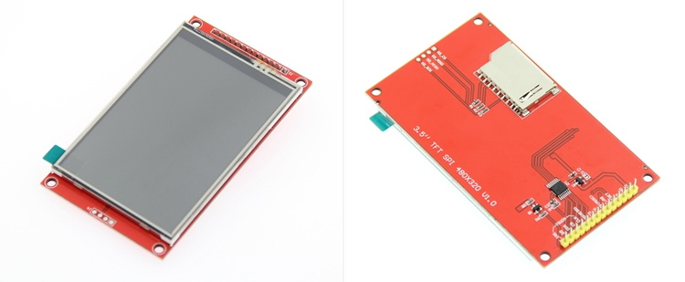

As a representative of the AMD Xilinx Zynq-7000 SoC platform, we will use the [Digilent Cora Z7](https://digilent.com/shop/cora-z7-zynq-7000-single-core-for-arm-fpga-soc-development/) development board.  
It's a nice small-factor, low-cost Zynq-7000 SoC board with excellent documentation and good board files available for Xilinx Vivado. It comes with a 667 MHz single-core Cortex-A9 processor with integrated programmable logic equivalent to Artix A7 FPGA and 512 MB of DDR3 memory.  It can accept standard Arduino shields (the ones that run on 3.3 V).
It is not the most powerful Zynq board, but it is more than adequate for the standalone single-thread application we will build in this project.

Please note that most steps in this tutorial are valid also for any other Zynq-7000 SoC board.

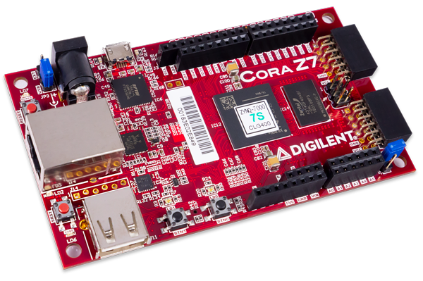

## Connecting the display

The 3.5&Prime; ILI9488 TFT SPI display is controlled by the SPI bus with a clock frequency of 20 MHz.  
In addition to the SPI, it has to be connected to two GPIO pins (reset and Data/Command selection signals).  
We need to connect the display pins highlighted in the photo below.

[](https://github.com/viktor-nikolov/ILI9488-Xilinx/blob/main/pictures/ILI9488_TFT_display_pins.png)

Logic IO pins accept a 3.3 V voltage level (TTL). VCC and LED (the backlight control) pins must be connected to a 3.3 V power source.

- Please note that we do not need to connect the "SDO (MISO)" pin of the display to SPI because we are not reading any data from the display.

I have chosen to connect logic IO pins to the Cora Z7 digital outer header pins named IO0..IO4. This is because 200 Ω resistors protect digital header pins against short circuits.  
Cora Z7 has two Pmod connectors. However, these are so-called high-speed Pmods whose pins are not protected.  
We will use a Pmod connector to get 3.3 V and GND, though.

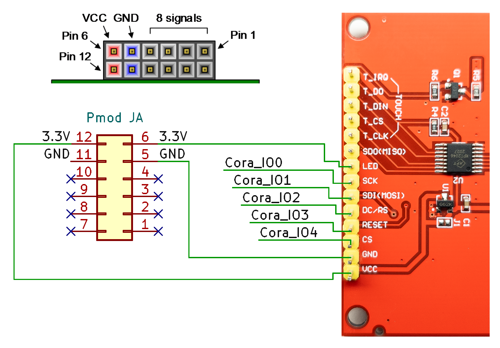

[](https://github.com/viktor-nikolov/ILI9488-Xilinx/blob/main/pictures/ILI9488_with_Cora_Z7.jpg)

## HW design in Vivado

Start Vivado 2023.1. Click Create Project. Click Next.  
Enter the project name and directory. Click Next.  
Select "RTL Project" and "Do not specify sources at this time". Click Next.

Now, we select the board. Click on "Boards" and type "cora" in the Search prompt.  
Select the version of the Cora Z7 you have. Cora Z7-07S is the board in production as of January 2024 (version -10 has been discontinued).  
Click on the download icon in the Status column if this is the very first time you use the board in Vivado.

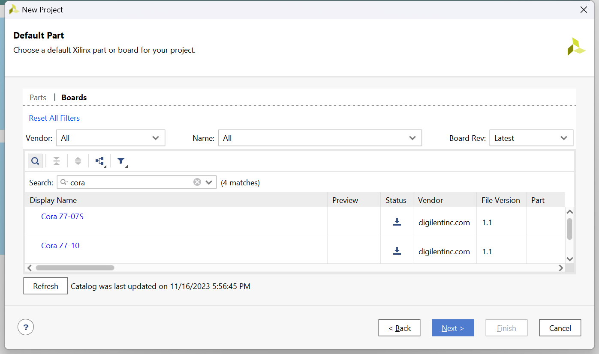

Click Next and Finish. The Vivado IDE will open an empty project.

Click Create Block Design, and name the design "system":


An empty block design window opens.

Before we use output ports in the block design, we need to define them in a constraints file (.XDC).  
Download Cora Z7 [Master XDC](https://github.com/Digilent/digilent-xdc/blob/master/Cora-Z7-07S-Master.xdc) from Digilent GitHub and import it as a constraints source file by clicking "+" icon in the Sources window; then follow the wizard.

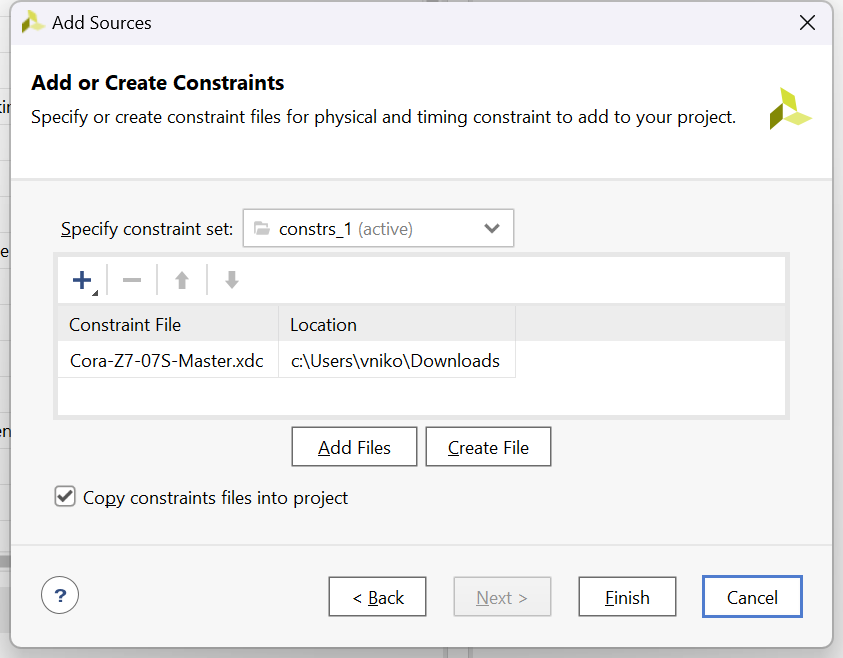

Open the imported constraints file in the editor.  
We are going to use Cora Z7 pins marked IO0..IO4 for connecting the display. They are named ports ck_io0..ck_io4  in the master XDC file. We, therefore, need to uncomment the following lines in the constraints file:

```
## ChipKit Outer Digital Header
#set_property -dict { PACKAGE_PIN U14   IOSTANDARD LVCMOS33 } [get_ports { ck_io0 }]; #IO_L11P_T1_SRCC_34 Sch=ck_io[0]
#set_property -dict { PACKAGE_PIN V13   IOSTANDARD LVCMOS33 } [get_ports { ck_io1 }]; #IO_L3N_T0_DQS_34 Sch=ck_io[1]
#set_property -dict { PACKAGE_PIN T14   IOSTANDARD LVCMOS33 } [get_ports { ck_io2 }]; #IO_L5P_T0_34 Sch=ck_io[2]
#set_property -dict { PACKAGE_PIN T15   IOSTANDARD LVCMOS33 } [get_ports { ck_io3 }]; #IO_L5N_T0_34 Sch=ck_io[3]
#set_property -dict { PACKAGE_PIN V17   IOSTANDARD LVCMOS33 } [get_ports { ck_io4 }]; #IO_L21P_T3_DQS_34 Sch=ck_io[4]
```

For clarity, it's good to add the name of the display pin we connect the port to as a port name suffix. The final content of our constraints file will then look as follows:

```
## ChipKit Outer Digital Header
set_property -dict { PACKAGE_PIN U14   IOSTANDARD LVCMOS33 } [get_ports { ck_io0_SCK  }]; #IO_L11P_T1_SRCC_34 Sch=ck_io[0]
set_property -dict { PACKAGE_PIN V13   IOSTANDARD LVCMOS33 } [get_ports { ck_io1_MOSI }]; #IO_L3N_T0_DQS_34 Sch=ck_io[1]
set_property -dict { PACKAGE_PIN T14   IOSTANDARD LVCMOS33 } [get_ports { ck_io2_DC   }]; #IO_L5P_T0_34 Sch=ck_io[2]
set_property -dict { PACKAGE_PIN T15   IOSTANDARD LVCMOS33 } [get_ports { ck_io3_RST  }]; #IO_L5N_T0_34 Sch=ck_io[3]
set_property -dict { PACKAGE_PIN V17   IOSTANDARD LVCMOS33 } [get_ports { ck_io4_CS   }]; #IO_L21P_T3_DQS_34 Sch=ck_io[4]
```

Now we can add the ports to the Block Design.  
Right-click on the empty diagram space and select Create Port for each of the ports.  
We specify all ports as Output and Type "Other".

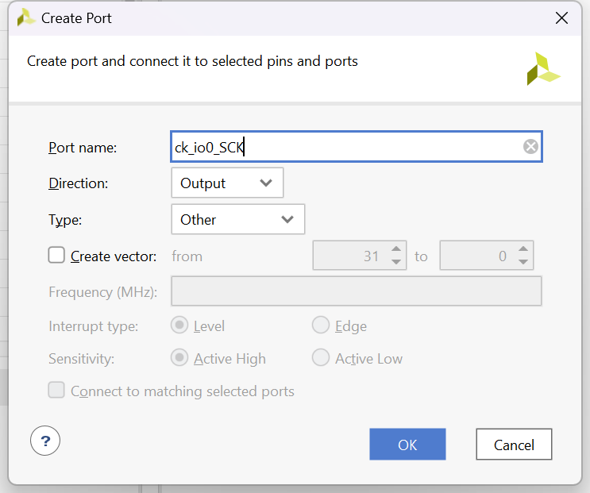

Now we add to the diagram an IP representing the Zynq Processing System.  
Search for "zynq" in the IP Catalog window and drag the "ZYNQ7 Processing System" to the diagram.

Now, we let Vivado make basic connections for us. Click Run Block Automation, which appeared at the top of the Diagram window. We accept all block automation defaults, so we just click OK.

This the results of the steps we did so far:

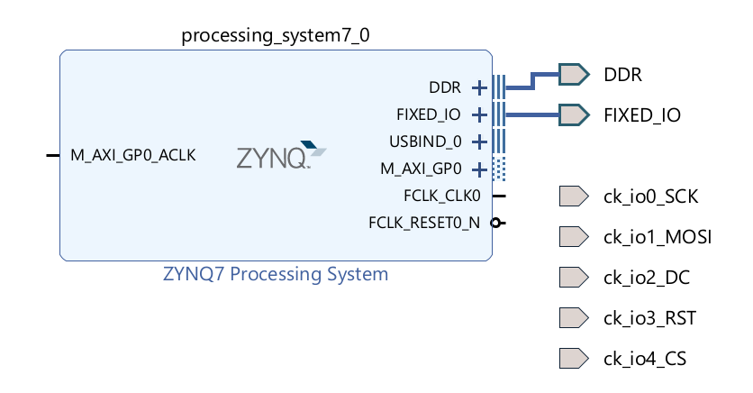

We must now configure the Zynq to expose GPIO and SPI interfaces.  
Double-click on the Zynq PS IP and click on the "SPI 0" on the top left of Zynq Block Design.

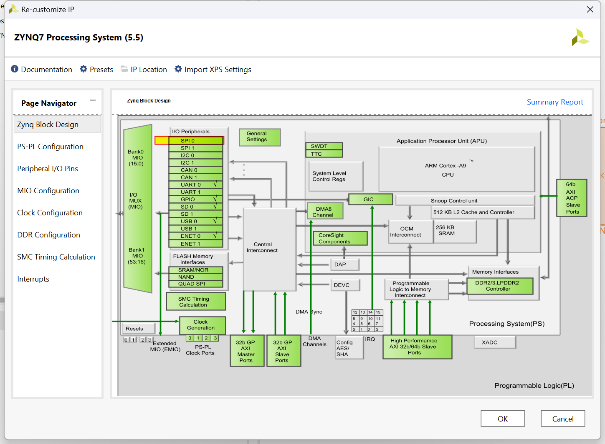

Enable SPI 0 in the list of MIO Configuration items.

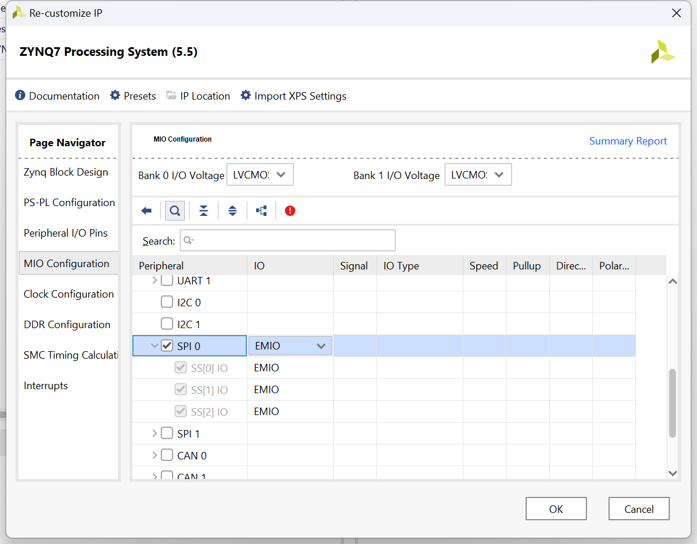

Then, scroll down the list and enable EMIO GPIO. Set the width to 2 (we need two GPIO signals for the display).

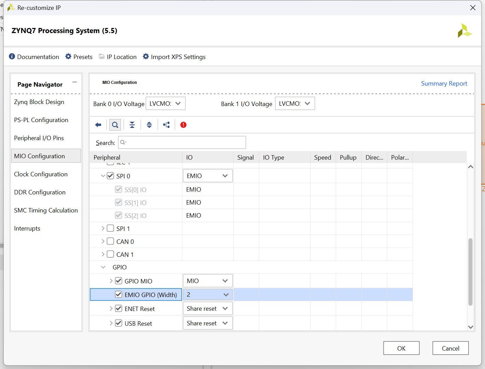

Because we are not using Zynq AXI interface in our design, we must switch it off in the Zynq configuration (othewise we would get a critical warning that we do not provide clock signal to the AXI interface).  
Go back to the Zynq Block Design and click on the "32b GP AXI Master Ports" at the bottom. Disable the "M AXI GP0 interface".

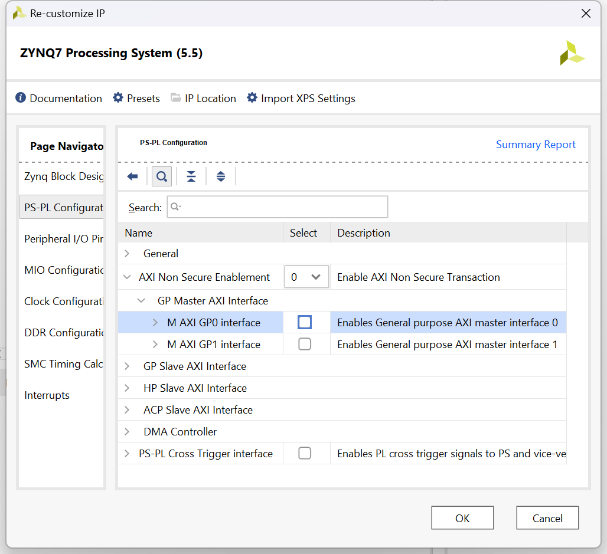

Click OK.  
You will probably get a critical warning message [PSU-1] and [PSU-2] about two parameters having a negative value. Ignore the warning. It doesn't have a negative impact on the functionality of the HW design.

New signal groups GPIO_0 and SPI_0 appeared on the Zynq PS IP.  
Let's start with connecting the SPI. When you expand the SPI_0, you will see a lot of signals. We need to connect just three of them (all with the suffix "_O") in the way shown in the following screenshot. (We don't need to connect the SPI0_MISO_I signal because we don't read any data from the display.)

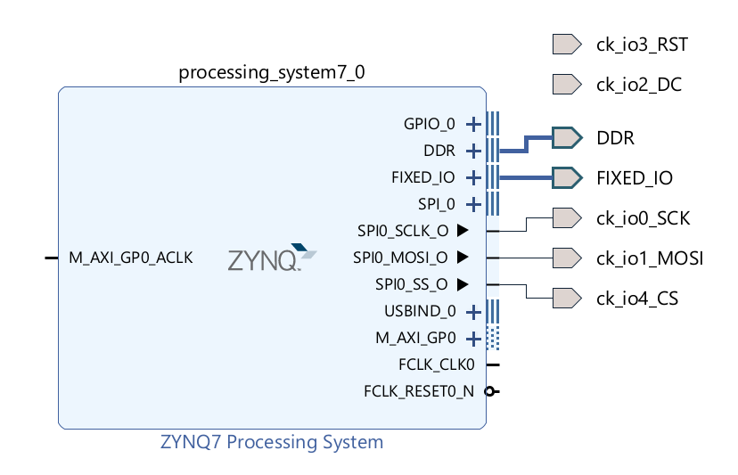

The next step is to connect GPIO_O[1:0] to the ck_io3_RST and ck_io2_DC ports.  
GPIO_O[1:0] is a vector of two signals. We will use Slice elements to "cut" the vector to the two scalar signals.

Search for "slice" in the IP Catalog and drag Slice two times to the diagram.  
Double-click on xlslice_0 and configure it to extract bit 0 from a 2-bit input:

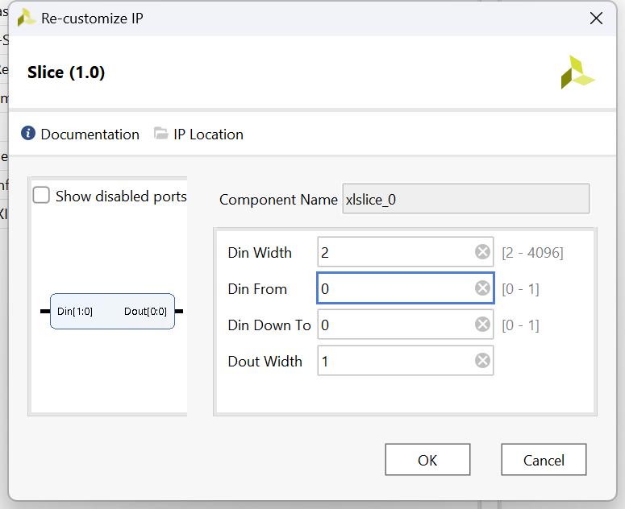

Next, configure xlslice_1 to extract bit 1 from the 2-bit input:

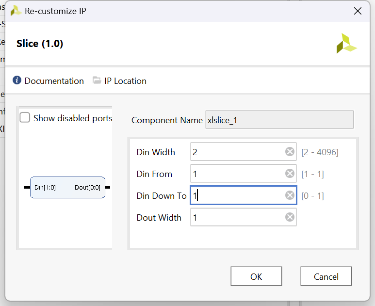

Connect inputs of both slices to the GPIO_O[1:0]. Output of xlslice_0 goes to port ck_io3_RST. xlslice_1 drives port ck_io2_DC.  
We now have our final diagram.

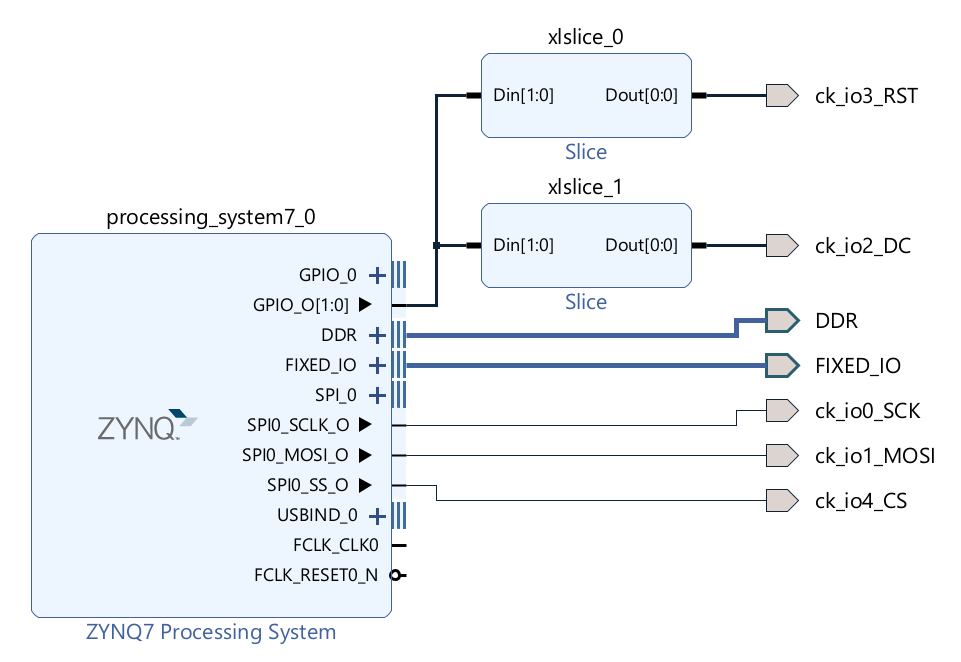

To make sure that nothing was missed, click the Validate Design button in the toolbar of the diagram window (or press F6). There should be no errors.

HDL Wrapper for the diagram needs to be created: Go to Sources|Design Sources, right-click on "system", select "Create HDL Wrapper", and select "Let Vivado manage wrapper".

Now, we create the design outputs: Click "Generate Bitstream" in the Flow Navigator on the left. Synthesis and Implementation will be run automatically before bitstream generation.

There should be no errors or critical warnings. (Some standard warnings will be generated, though.)

Last but not least, we need to export the hardware specification. It is necessary for the development of the SW app for the Zynq ARM core in Vitis IDE.  
Go to File|Export|Export Hardware, select "Include Bitstream". Set the XSA file name as "system_wrapper", as suggested by the Export Hardware wizard.

## SW application in Vitis

Start Vitis 2023.1.  
Enter the path to a directory where you want to store the workspace and click "Launch."

The first step is to create a platform project based on the HW design we created in Vivado.  
Click on "Create Platform Project". Name the project "system". On the next screen, we select the XSA file, which we created by "Export Hardware" in Vivado.  
Click on Browse and go to the root folder of your HW project (where the .xpr file is). Here you should find the "system_wrapper.xsa". The wizard will read the XSA file. Set the Operating system to "standalone" and click Finish. The Vitis IDE will open the platform project "system".

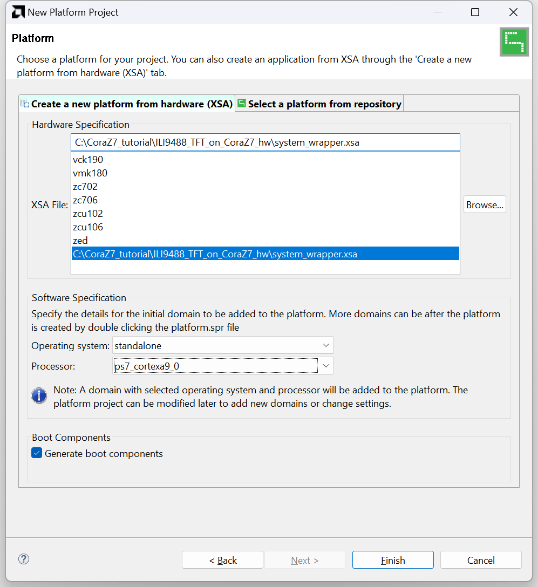

With the platform created, we now create the application project.  
Select File|New|Application project. Skip the first page of the wizard.   
On the next screen, we select the platform project "system", which we created a moment ago. Click Next.

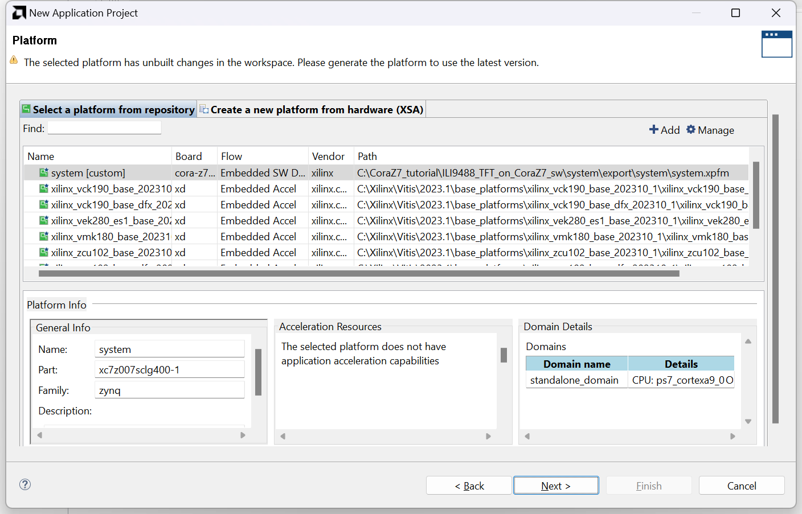

On the next screen, fill the "Application project name" with a name, for example, "ILI9488_CoraZ7". The rest of the fields will be filled automatically. Click Next.

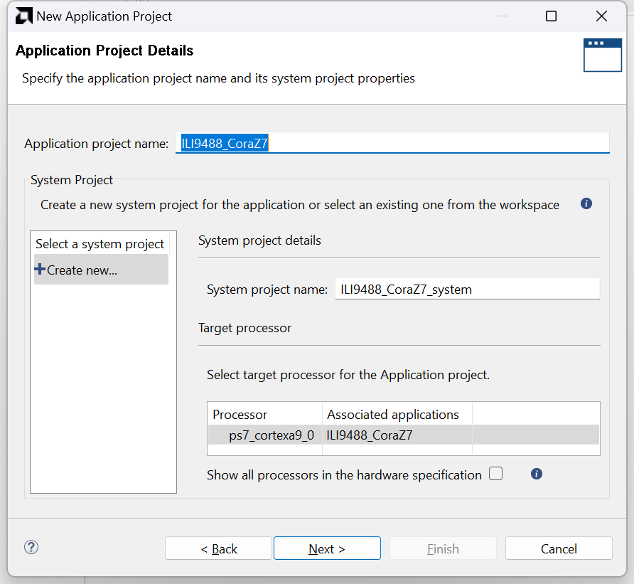

On the next screen, we just confirm that we are using standalone_domain. Then, on the last screen, select the project template "Empty Application (**C++**)".  
We now have an empty application project created.

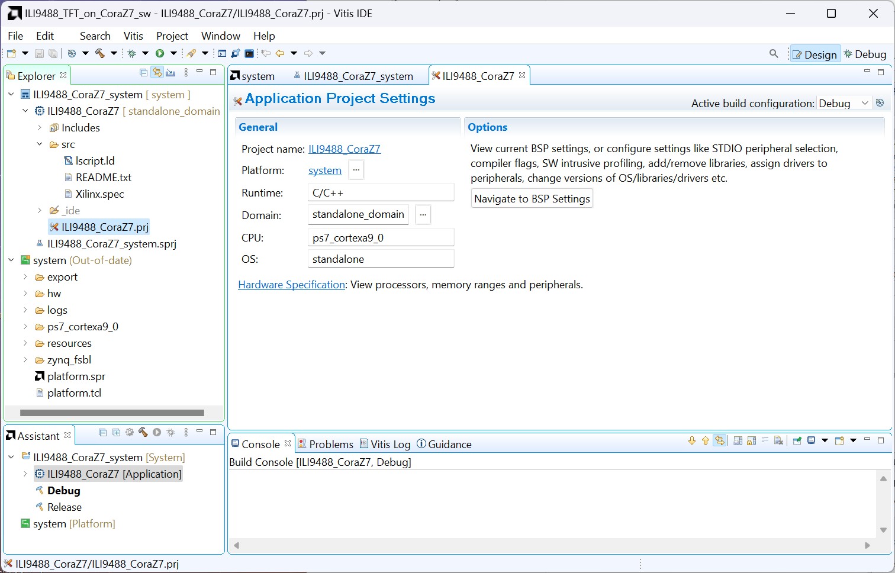

Now, it's time to add some source code.  
Let's start with my [ILI9488 library for Xilinx](https://github.com/viktor-nikolov/ILI9488-Xilinx). Download the content of [this GitHub directory](https://github.com/viktor-nikolov/ILI9488-Xilinx/tree/main/ILI9488-Xilinx_library) and paste it into the src directory of the application project (you can do "Paste" in the Explorer in Vitis). 


> [!TIP]
>
> If you don't have git installed on your computer, the easy way to download the content of a folder from a GitHub repository is to use [download-directory.github.io](https://download-directory.github.io/).
> To get the ILI9488-Xilinx_library folder content, enter the path `https://github.com/viktor-nikolov/ILI9488-Xilinx/tree/main/ILI9488-Xilinx_library`.

Next, **(TODO) download the files main.cpp, demo_image1.h and demo_image2.h,** which I prepared for the purpose of this tutorial. Paste them in the src directory of the application project.  
(You can delete the README.txt file from the src folder. It doesn't contain any important information.)

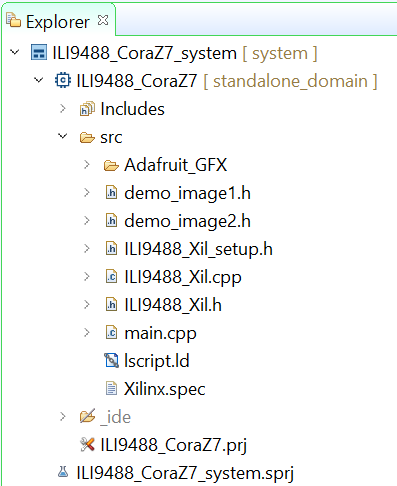

The **main.cpp** contains a demo, which shows most of the abilities of the ILI9488 library.  
You just need to run Project|Build all and then run the application: right-click on ILI9488_CoraZ7, Run As|Launch Hardware (Single Application Debug).

This YouTube video shows what the demo application does:  
<a href="http://www.youtube.com/watch?v=Yp6-icTad4Y">
 </a>

In the next chapters, I'm providing more details about what is happening in the main.cpp.

> [!IMPORTANT]
> The compiler optimization matters!  
> There is a code in the library (especially in ILI9488::fillRect) which is CPU intensive.
>
> Do build the final application in the Release configuration.
>
> I recommend changing the Properties|C/C++ Build|Setting|Optimization to "Optimize most (-O3)" (the default is -O2 optimization setting).  
> I measured that using -O3 increases the library's performance as compared to -O2.

## Preparing GPIO and SPI

In general, the display can be connected to the system using Zynq Processing System SPI or AXI SPI and PS GPIO or AXI GPIO. We need to tell the library that we are using PS SPI and PS GPIO.  
The library is configured by editing the header [ILI9488_Xil_setup.h](https://github.com/viktor-nikolov/ILI9488-Xilinx/blob/main/ILI9488-Xilinx_library/ILI9488_Xil.h). (The ILI9488_Xil_setup.h is being included by the [ILI9488_Xil.h](https://github.com/viktor-nikolov/ILI9488-Xilinx/blob/main/ILI9488-Xilinx_library/ILI9488_Xil.h).). We must edit the following section of this header, uncommenting one of the macros for SPI and one of the macros for GPIO:

```c
/**** select one of the SPI types used by given application ****/
#define ILI9488_SPI_PS  //SPI of Zynq Processing Systems is used.
//#define ILI9488_SPI_AXI //AXI Quad SPI IP is used.

/**** select one of the GPIO types used by given application ****/
#define ILI9488_GPIO_PS  //EMIO GPIO of Zynq Processing Systems is used.
//#define ILI9488_GPIO_AXI //AXI GPIO IP is used.
```

In order to use the ILI9488 library (i.e., the class ILI9488 defined in [ILI9488_Xil.h](https://github.com/viktor-nikolov/ILI9488-Xilinx/blob/main/ILI9488-Xilinx_library/ILI9488_Xil.h)), we need to provide it with initialized, ready-to-use instances of SPI and GPIO drivers.  
The drivers are initialized in functions initialize_PS_GPIO() and initialize_PS_SPI() in main.cpp. Let me explain how the initialization is done.

Note: Normally, we would need to include headers [xgpiops.h](https://xilinx.github.io/embeddedsw.github.io/gpiops/doc/html/api/xgpiops_8h.html) and [xspips.h](https://xilinx.github.io/embeddedsw.github.io/spips/doc/html/api/xspips_8h.html) in our source code to be able to work with PS GPIO and PS SPI drivers. Nevertheless, the [ILI9488_Xil.h](https://github.com/viktor-nikolov/ILI9488-Xilinx/blob/main/ILI9488-Xilinx_library/ILI9488_Xil.h) already included these two headers for us.

For GPIO driver initialization, we first need to load the configuration of our GPIO device:

```c
XGpioPs_Config *GpioConfig;

GpioConfig = XGpioPs_LookupConfig( XPAR_PS7_GPIO_0_DEVICE_ID );
if( GpioConfig == NULL ) {
    //report an error
}
```

XPAR_PS7_GPIO_0_DEVICE_ID is a macro defined in xparameters.h, which was generated in the platform project based on the HW design we made in Vivado. XPAR_PS7_GPIO_0_DEVICE_ID provides the ID of the GPIO device 0.

With the configuration loaded, we initialize the GPIO driver:

```c
XGpioPs GpioInstance;
int Status;

Status = XGpioPs_CfgInitialize( &GpioInstance, GpioConfig, GpioConfig->BaseAddr );
if( Status != XST_SUCCESS ) {
    //report an error
}
```

After initializing the GPIO driver, we need to do the SW configuration of the pins.  
In our HW design, we configured two EMIO GPIO pins. There are 54 MIO GPIO pins on Zynq, numbered 0..53. The EMIO pins follow after the MIO pins. Therefore the first EMIO pin has number 54.  
The following two macros define the numbers of RST and DC pins:

```c
#define ILI9488_RST_PIN  54 //== EMIO pin 0
#define ILI9488_DC_PIN   55 //== EMIO pin 1
```

In the following cycle, we configure both pins as output pins, enable them, and drive them low.

```c++
std::vector<int> outputPins = { ILI9488_RST_PIN, ILI9488_DC_PIN };
for( auto p : outputPins ) {
    XGpioPs_SetDirectionPin( &GpioInstance, p, 1 /*output*/ );
    XGpioPs_SetOutputEnablePin( &GpioInstance, p, 1 /*enable*/ );
    XGpioPs_WritePin( &GpioInstance, p, 0 /*low*/ );
}
```

Let's now initialize the SPI.  
As with GPIO, we first load the SPI device configuration.

```c
XSpiPs_Config *SpiConfig;

SpiConfig = XSpiPs_LookupConfig( XPAR_PS7_SPI_0_DEVICE_ID );
if( SpiConfig == NULL ) {
    //report an error
}
```

XPAR_PS7_SPI_0_DEVICE_ID is a macro defined in xparameters.h, which was generated in the platform project based on the HW design we made in Vivado. XPAR_PS7_SPI_0_DEVICE_ID provides the ID of the SPI device 0.

> [!NOTE]
> On Zynq boards, which have Quad SPI Flash (e.g., [Zybo Z7](https://digilent.com/shop/zybo-z7-zynq-7000-arm-fpga-soc-development-board/)), the ID of SPI 0 is provided by the macro XPAR_PS7_**QSPI**_0_DEVICE_ID.

With the configuration loaded, we initialize the SPI driver and perform a self-test. The function [XSpiPs_SelfTest](https://xilinx.github.io/embeddedsw.github.io/spips/doc/html/api/group__spips.html#gaaa797b9b8184e6f39b0c0038553e48d8) verifies that there really is an SPI device connected to the driver.

```c
XSpiPs SpiInstance;
int Status;

Status = XSpiPs_CfgInitialize( &SpiInstance, SpiConfig, SpiConfig->BaseAddress );
if( Status != XST_SUCCESS ) {
    //report an error
}

Status = XSpiPs_SelfTest( &SpiInstance );
if( Status != XST_SUCCESS ) {
    //report an error
}
```

Next, we configure our device as SPI Master (the display works as an SPI Slave), and we set the Force Slave Select option of the PS SPI driver.  
With the Force Slave Select option enabled, the slave select signal SPI0_SS_O will be driven low (meaning "slave 0 active") as soon as we call function [XSpiPs_SetSlaveSelect](https://xilinx.github.io/embeddedsw.github.io/spips/doc/html/api/group__spips.html#ga1ef5af2211095df5692567fa4721a8d5). Without Force Slave Select enabled, the SPI0_SS_O will be driven low only when data transfer is in progress.  
The display will work with any setting of the Force Slave Select option. However, we gain a bit of SPI data transfer performance with the Force Slave Select option enabled because keeping SPI0_SS_O low all the time eliminates a delay before the start of the data transfer.  
The following call sets the options:

```c
Status = XSpiPs_SetOptions( &SpiInstance, XSPIPS_MASTER_OPTION | XSPIPS_FORCE_SSELECT_OPTION );
if( Status != XST_SUCCESS ) {
    //report an error
}
```

And the next call sets SPI Slave 0 as active: 

```c
Status = XSpiPs_SetSlaveSelect( &SpiInstance, 0 );
if( Status != XST_SUCCESS ) {
    //report an error
}
```

In our simple HW design we have just the display connected to PS SPI. However, in a more complex design, you may have several SPI peripherals connected and would be switching between them by calling XSpiPs_SetSlaveSelect.

The last step in configuring the SPI is setting the SPI clock frequency.  
The Zynq PS default SPI clock is 166.67 MHz. You can scale this frequency down by a power of two factors by calling [XSpiPs_SetClkPrescaler](https://xilinx.github.io/embeddedsw.github.io/spips/doc/html/api/group__spips.html#ga146ed84d7a6ab3b3f8961697bd78da60).  
The [ILI9488 datasheet](http://www.lcdwiki.com/res/MSP3520/ILI9488%20Data%20Sheet.pdf) specifies that the shortest possible SPI clock cycle for write operations is 50 ns, i.e., 20 MHz (see page 332 in the datasheet).

For getting a setting closest to the ILI9488 rated 20 MHz, we can call 
```c
Status = XSpiPs_SetClkPrescaler( &SpiInstance, XSPIPS_CLK_PRESCALE_8 );
if( Status != XST_SUCCESS ) {
    //report an error
}
```
which gives us an SPI clock of 20.83 MHz (==&nbsp;166,67&nbsp;/&nbsp;8).  
20.83 MHz is higher than the 20 MHz from the datasheet. Nevertheless, my specimen of the display worked well at this frequency.

If you want to be on the safe side, you can set the SPI frequency to 150 MHz in the Zynq configuration in Vivado. Then, with the factor XSPIPS_CLK_PRESCALE_8, you get the SPI frequency of 18,75 MHz.

## Using the ILI9488 library

Now, we have the GPIO and SPI drivers fully initialized and configured for our needs. Before drawing things on display, we need to initialize the library, i.e., the class ILI9488.

The ILI9488 has an empty constructor.  
The initialization of the class and configuration of the display is done by the method ILI9488::init. During the execution of ILI9488::init, configuration commands are sent to the display over SPI.

We pass to ILI9488::init initialized SPI and GPIO instances and numbers of display reset and DC pins.

```c++
ILI9488 display;
display.init( &SpiInstance, &GpioInstance, ILI9488_RST_PIN, ILI9488_DC_PIN );
```

After calling the ILI9488::init, you will probably want to set the rotation of the display by calling, for example:

```c++
display.setRotation( 3 );
```

The following image shows the effect of calling ILI9488::setRotation with different parameter values. The default setting is setRotation(0).

[](https://github.com/viktor-nikolov/ILI9488-Xilinx/blob/main/pictures/rotations.png)

You can refer to the Adafruit GFX library's [reference](https://adafruit.github.io/Adafruit-GFX-Library/html/class_adafruit___g_f_x.html) and the [user guide](https://cdn-learn.adafruit.com/downloads/pdf/adafruit-gfx-graphics-library.pdf) for information on drawing graphic elements. You just need to ignore Arduino-specific aspects of the Adafruit GFX library.

In the **main.cpp**, I strived to show the usage of the most common Adafruit GFX methods. Check the functions called from main().
